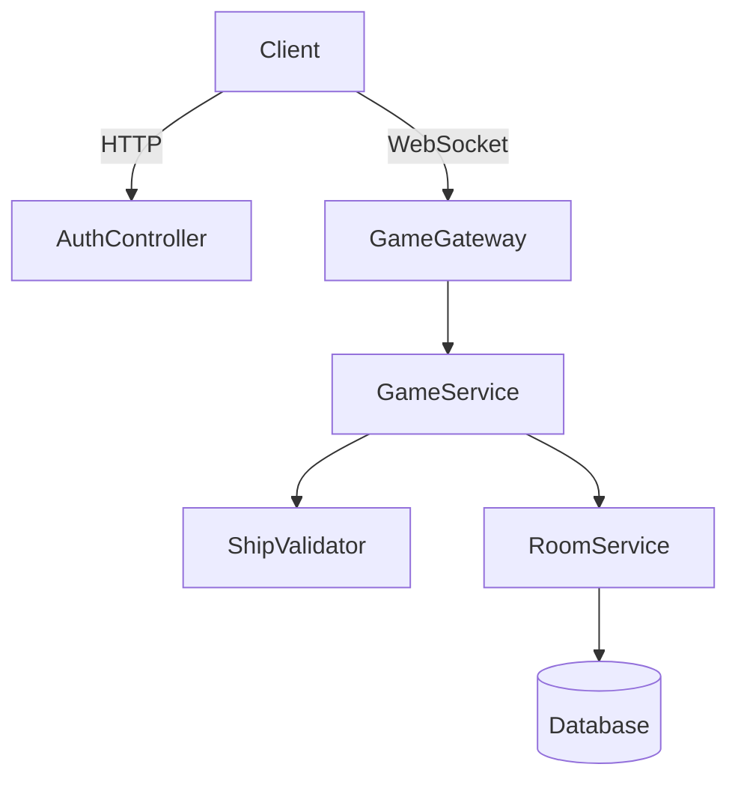

### ТЗ Архитектуры Игры "Морской Бой" на NestJS

---

план на следующие шаги
- подключить монгу
- сделать регистрацию пользователей

#### **1. Обзор Системы**
- **Тип приложения**: Многопользовательский REST/WebSocket сервер.
- **Цель**: Реализация игры "Морской бой" с возможностью онлайн-боёв, расстановки кораблей, пошаговой стрельбы и определения победителя.
- **Стек**: NestJS, TypeScript, WebSocket (Socket.IO), PostgreSQL/TypeORM, Redis (для сессий/кеша).

---

#### **2. Модули Приложения**
1. **`AuthModule`**  
   - Регистрация/аутентификация (JWT).
   - DTO: `LoginDto`, `RegisterDto`.
   - Сервис: `AuthService`.
   - Контроллер: `AuthController`.

2. **`UserModule`**  
   - Управление профилями пользователей.
   - Сущность: `User` (id, email, username, password).
   - Сервис: `UserService`.
   - Контроллер: `UserController`.

3. **`GameModule`** (Ядро)  
   - Логика игры: создание комнат, расстановка кораблей, ходы.
   - Подмодули: `Room`, `Match`, `Ship`, `Board`.

4. **`WebSocketModule`**  
   - Реальная коммуникация между игроками.
   - Шлюзы: `GameGateway` (обработка событий WebSocket).

5. **`SharedModule`**  
   - Утилиты, DTO, конфиги, интерсепторы.

---

#### **3. Сущности (TypeORM)**
1. **`User`**  
   ```typescript
   @Entity()
   class User {
     @PrimaryGeneratedColumn()
     id: number;
     
     @Column({ unique: true })
     email: string;
   }
   ```

2. **`Room`** (Игровая комната)  
   ```typescript
   @Entity()
   class Room {
     @PrimaryGeneratedColumn('uuid')
     id: string;
     
     @Column()
     status: 'waiting' | 'active' | 'finished';
     
     @ManyToOne(() => User)
     player1: User;
     
     @ManyToOne(() => User, { nullable: true })
     player2: User | null;
   }
   ```

3. **`Game`** (Экземпляр матча)  
   ```typescript
   @Entity()
   class Game {
     @PrimaryGeneratedColumn('uuid')
     id: string;
     
     @OneToOne(() => Room)
     room: Room;
     
     @Column('jsonb') // Пример: { player1: BoardState, player2: BoardState }
     state: Record<string, BoardState>;
   }
   ```

4. **`BoardState`** (Вложенный объект)  
   ```typescript
   type BoardState = {
     ships: ShipPosition[]; // [{ type: 'destroyer', positions: [[x1,y1], [x1,y2]] }]
     shots: Array<{ x: number; y: number; hit: boolean }>;
   };
   ```

---

#### **4. Сервисы**
1. **`RoomService`**  
   - `createRoom(userId)`: Создание комнаты.
   - `joinRoom(roomId, userId)`: Присоединение к комнате.
   - `startGame(roomId)`: Начало игры (проверка готовности).

2. **`GameService`**  
   - `placeShips(gameId, userId, ships: ShipPosition[])`: Расстановка кораблей.
   - `makeShot(gameId, userId, x: number, y: number)`: Обработка выстрела.
   - `checkWinCondition(gameId)`: Проверка победы.

3. **`ShipValidatorService`**  
   - Валидация кораблей:
     - Размеры (4-палубный, 3-палубный ×2, ...).
     - Наложение кораблей/выход за границы.
     - Расстояние между кораблями ≥1 клетки.

---

#### **5. Контроллеры (REST API)**
- **`AuthController`**
  - `POST /auth/login` → Аутентификация пользователя.
    - **Body**: `{ "email": "user@example.com", "password": "password" }`
    - **Returns**: `{ "access_token": "jwt_token" }`
  - `POST /auth/profile` → Получение профиля пользователя (требуется JWT).
    - **Headers**: `{ "Authorization": "Bearer jwt_token" }`
    - **Returns**: `{ "id": 1, "email": "user@example.com", "username": "user" }`

- **`RoomController`**
  - `POST /rooms` → Создать комнату.
  - `POST /rooms/:id/join` → Присоединиться.
  - `GET /rooms` → Список активных комнат.

- **`GameController`**
  - `POST /games/:id/ships` → Расставить корабли.
  - `POST /games/:id/shot` → Сделать выстрел.

---

#### **6. WebSocket Events (Socket.IO)**
- **События**:
  - `room_created` (новая комната).
  - `player_joined` (игрок присоединился).
  - `ships_placed` (корабли расставлены).
  - `shot_fired` (выстрел, результат: hit/miss/sunk).
  - `game_over` (победитель определён).

- **Пример обработки**:
  ```typescript
  @WebSocketGateway()
  class GameGateway {
    @SubscribeMessage('shot')
    handleShot(client: Socket, data: { gameId: string; x: number; y: number }) {
      const result = this.gameService.makeShot(data);
      this.server.emit(`game_update:${data.gameId}`, result);
    }
  }
  ```

---

#### **7. Валидация и Безопасность**
- **Guard-ы**: 
  - `JwtAuthGuard`: Защита эндпоинтов.
  - `RoomOwnerGuard`: Только создатель комнаты может её стартовать.
- **Pipe**: 
  - `ValidationPipe` для DTO.
  - Кастомная валидация кораблей через `ShipValidator`.

---

#### **8. Алгоритм Игры**
1. **Инициализация**:
   - Игрок создаёт комнату → `Room` в БД.
   - Второй игрок присоединяется → `room.status = 'active'`.

2. **Расстановка кораблей**:
   - Оба игрока отправляют координаты кораблей.
   - Сервис `ShipValidator` проверяет корректность.

3. **Бой**:
   - Игроки ходят по очереди (хранится в `Game.currentTurn`).
   - При выстреле:
     - Проверка ячейки: попадание/промах.
     - Обновление состояния доски.
     - Проверка условия победы (все корабли противника потоплены).

---

#### **9. Тестирование**
- **Юнит-тесты**: Сервисы (`GameService`, `ShipValidator`).
- **Интеграционные тесты**: Контроллеры + WebSocket.
- **e2e**: Симуляция полного игрового цикла.

---

#### **10. Развёртывание**
- **Инфраструктура**: Docker-контейнеры (NestJS + PostgreSQL + Redis).
- **CI/CD**: GitHub Actions → автоматические тесты и деплой на сервер.

---

#### **Диаграмма Компонентов**


---

#### **Типовые Сценарии**
1. **Создание комнаты**:  
   `POST /rooms` → `201 Created` + `{ roomId: uuid }`.

2. **Выстрел**:  
   `socket.emit('shot', { gameId, x: 5, y: 3 })` → Шлюз проверяет очередь, обновляет игру, отправляет результат.

---

**Итог**: Архитектура обеспечит масштабируемость, чёткое разделение ответственности и поддержку реального времени через WebSocket. Для сложной логики (например, ИИ для одиночной игры) можно добавить модуль `AIService`.